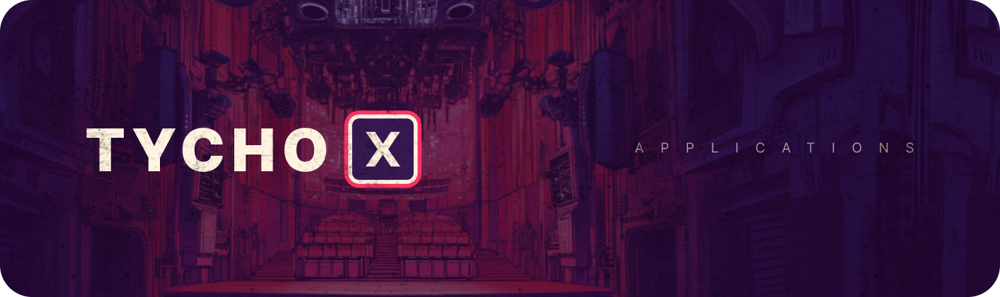

# Tycho X

Ideas for open source apps on Tycho.

## Ideas
- [TAP-0](TAP-0.md) – **Tycho Application Proposal Template**: Template.
- [TAP-1](TAP-1.md) – **Pool Explorer**: A local UI to explore DEX pools. Filter for, and explore DEX pools, with low-latency, full coverage and trustlessly reliable data.
- [TAP-2](TAP-2.md) – **Orderbook**: All on-chain liquidity for a token pair presented in familiar orderbook format. Including the routes to execute at a price / depth.
## Build an app
- **Get inspiration**: Use the ideas above to build apps on Tycho for the community.
- **Share what you built**: Add a link to your app in the relevant TAP.
- **Get support on telegram**: Get support from Tycho community and maintainers in our tg group: [tycho.build](https://tycho.build/)