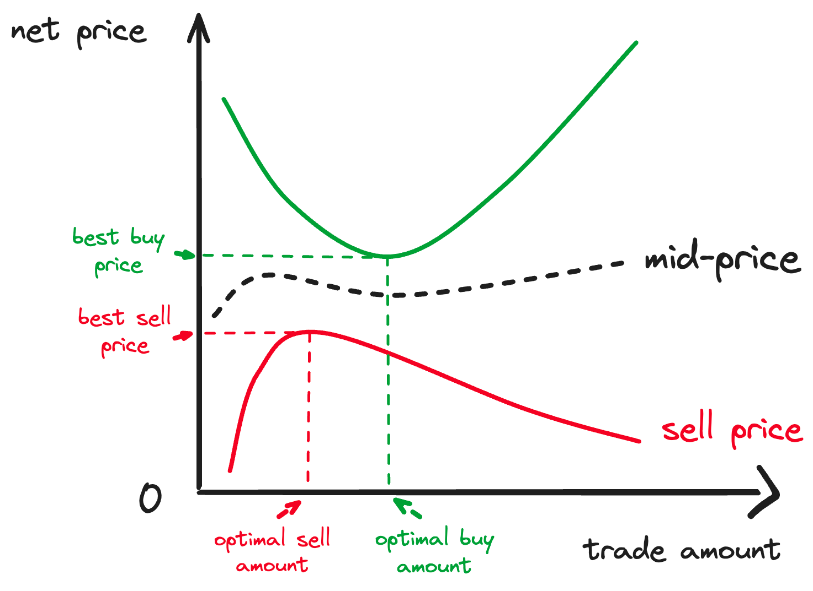

# Price Quoter

# tldr;
A fast, trustless price oracle covering all tokens, based on on-chain data – that anyone can use to get real-time, on-chain prices and spreads.
# Implementations
NA - there are no implementations yet of this Tycho Extension.
# Motivation
**High speed, broad coverage, 0 downtime price oracle**: Calculate prices for tens of thousands of tokens in milliseconds, cover every token that is traded anywhere on-chain, as soon as there is a single pool – and have the data availabily and reliability gurantees as the chain itself.

**Highle reliable and adaptive - based on routing**: Calculate prices on exactly where liquidity for this token is right now – and adapt the calculation logic dynamically to any movements in liquidity to different pools.

**Transparent and trustless**: Make pricing logic simple, transparent and let clients verify instead of trust the data integrity - and hence the derived prices

**Flexible**: Make it easy to modify the price quoter to individual demands. Adjusting the token coverage, or price derivation logic.
# Background
**Token Price APIs are not enough**: Today, the only way to get the current price of a token is to use one of many token price APIs. However they are limiting for several reasons:
- **High latency**: To get a price for a token, you need to add at least one network roundtrip. In the context of many users (traders) this is slow, and especially so if you want to know the prices for thousands or even hundreds of thousand of tokens.
- **Limited coverage**: Every token price provider makes tradeoffs and does not cover *every* token. But many users have special needs – e.g. needing to know prices for tokens that launched *this block* immediately (meme coin), or for tokens with low liquidity, or for tokens that only exist on long-tail DEXs (e.g. only on Curve) that the price API does not cover.
- **Trusted**: Consumers need to trust the third party provider on the integrity of the data. Any mistake (e.g. block delay, or bug in aggregation logic) can have serious consequences for some users (e.g. those that trade based on the price information). 
- **Lack of transparency**: How prices are derived is rarely disclosed (e.g. is it a median or mean of Univ3 pools at mid price, or does it include / exclude spread) – and there is no, or very limited, flexibility for consumers of the API to change how price is derived.
- **Downtime**: All APIs have downtime, which translates to economic loss (for traders), or at least bad UX (e.g. for wallets). And providers might make changes, or discontinue the service at any time.
- **Costly**: For production usage, most APIs also charge and can become costly, excluding many use cases that require frequent and broad coverage of tokens. (e.g. pairs trading that covers thousands of tokens).

**Oracles are not enough**: Oracles suffer from many of the same limitations – they are entirely dependent on third parties, the aggregation logic is frequently not public, and they can have downtime at any time that consumers have no control over as they rely on off-chain infrastructure. And they only cover a very limited set of tokens. Additionally: 
- **Mostly cover tokens traded on CEXs**: Most oracles rely on market maker feeds based *purely* on CeFi liquidity. Meaning that tokens that are traded only or primarily on-chain are not supported by many oracles or oracle price providers.
- **Do not provide realistic liquidity**: Most oracles are used for on-chain use cases. But here, e.g. for a lending protocol's liquidation margin, what often counts more is liquidity that is available now on-chain, not off-chain.

**Single pool on-chain oracles are also not enough**: Relying on a single, often hard-coded, pool for price quotes is also not reliable: The price on a single pool can easily vary by its spread from the true market mid-price, and, more importantly, liquidity can entirely move, in a single block, to another pool – making the price on the original pool outdated and easily manipulable.
**Use Cases for token quoting**: A trustless, broad coverage and low latency token quoter is useful to many. For example: 
- Build a price provider to oracles like Pyth
- Track portfolio value for wallets and wallet trackers
- Build a real-time price chart to track on-chain token prices, or
- Calculate effective spread / price impact and slippage on quotes from exchanges / RFQ or OTC.
- Calculate fees for gas as a relayer / paymaster.
# Goal
The goal of this project is to build a trustless, super low-latency, highly reliably and flexible price quoting service that anyone who want to have real time prices on any token traded on-chain can run and use freely.
# Specification
## Definitions
## Requirements
### Essential Requirements
- **Price in ETH**: The ability to get the price for any token (given the token address) in terms of ETH.
### Important Requirements
- **Arbitrary Numeraire**: The ability to get the price of any token in terms of an arbitrary numeraire token (defined by its address) – e.g. USDC, EURC, etc.
- **Arbitrary depth**: Let users define the depth at which to probe the orderbook to define the mid-price. Denominated in the numeraire.
- **Gas Price**: Include the cost of gas to execute the trade in the net price (and hence in the spread).
- **Spread at depth**: Return also spread at chosen depth, in basis points. Gross and net gas (if gas feature is implemented otherwise just gross gas).
- **N-hop parameter**: Let users define the maximum number of hops from token to numeraire token that the network search is allowed to take. Less hops will not cover some tokens, and might overlook some more liquid paths, but will be much faster. (absolute max should be no higher than 4 as the network will unreasonably explode here and might lead to bad UX if someone doesn't appreciate the implications of this setting).
- **Cache for faster queries**: Cache all paths you calculated. And then only re-check the paths where at least on pool had an update since the block that this path was last updated.
### Nice-to-have requirements
- **Save price history**: Let users define tokens to track and calculate and save the price of these tokens to file at every block update, as long as the indexer is running. 
- **Split across non-overlapping paths**: Instead of using the single path with the best price, use all parallel, non-overlapping, paths and split the trade efficiently between them, to receive a more precise quote.
- **Calculate all prices**: Include a default setting where the app calculates and holds in memory all prices for all tokens it knows of. And updates them with every block continuously.
- **Find best net price**: Instead of using a fixed depth, find the depth at which you can achieve the best net price (`net_price = (amount_out - gas_interms_of_token_out) / amount_in`) in both directions. Then take the mid-point between those prices.
	- 
## Not included
# Implementation
You can derive the price for any token in terms of another in the following steps:

1. Set parameters: N: max hops to consider in path search, M : depth in numeraire atoken at which to quote each path, numeraire token address: the token in terms of which to quote all prices.
2. Build a network from all available liquidity pools (nodes are tokens, pools are edges).
3. Find all paths of max depth N (N-hop parameter) from numeraire to the target token.
4. Swap M tokens (depth parameter) of numeraire to target token on all paths.
5. (optional) Account for gas cost of the path (deduct from amount out).
6. Pick the path with best (net gas) price.
7. Swap the amount out given by the first swap, back into the other direction on the same path.
8. Denote the of the prices from the two swaps, denominated in the numeraire token, as the tokens price.
9. (optimal) Denote the mean difference of the swap prices at depth M to the mid-price (net gas), as the spread (denominated in basis points).
## Design
*Just a draft for inspiration – take and leave what you like. Not a suggestion for language (preferably implement in Rust).*
```ts
// Core Domain Types
type TokenAddress = string;

type NetworkPath = {
  tokens: TokenAddress[];  // Ordered list of tokens in path
  pools: string[];        // Pool addresses used in path
  protocols: string[];    // DEX protocols used in each hop
}

type PriceQuote = {
  tokenIn: TokenAddress;
  tokenOut: TokenAddress;
  price: string;          // Price in terms of tokenOut
  timestamp: number;
  blockNumber: number;
  path: NetworkPath;      // Best route used for price calculation
  spreadBps: number;      // Spread in basis points
  gasEstimate: {
    wei: string;
    tokenIn: string;
    tokenOut: string;
  };
}

// Query Options - only essential parameters
type PriceQueryOptions = {
  maxHops?: number;           // Maximum route length (default: 3)
  probeDepthAmount: string;   // Amount to probe for depth calculation
}

type TrackingOptions = {
  tokens: TokenAddress[];     // Tokens to track
  storageConfig: {
    format: 'csv' | 'json';
    filepath: string;
    maxHistoryDays?: number;
  };
}

// Price Network State
type PriceNetworkState = {
  lastUpdateBlock: number;
  lastUpdateTimestamp: number;
  knownTokens: TokenAddress[];
  activeProtocols: string[];
  
  // Cache both prices and their paths
  pathCache: Map<string, {
    path: NetworkPath;
    calculatedForBlock: number;    // Block number whose state was used for calculation
    price: string;
  }>;

  liquidityGraph: {
    nodes: TokenAddress[];
    edges: Array<{
      poolAddress: string;
      protocol: string;
      token0: TokenAddress;
      token1: TokenAddress;
      lastUpdated: number;     // Block number when pool was last updated
    }>;
  };
}

// Core Operations Interface
interface PriceOracleOperations {
  // Core price fetching
  getPrice(
    tokenIn: TokenAddress,
    tokenOut: TokenAddress,
    options?: PriceQueryOptions
  ): Promise<PriceQuote>;

  // Batch operations
  getPricesForTokens(
    tokens: TokenAddress[],
    numeraire: TokenAddress,
    options?: PriceQueryOptions
  ): Promise<Map<TokenAddress, PriceQuote>>;

  // Price tracking
  startTrackingTokens(
    options: TrackingOptions
  ): Promise<{ stopTracking: () => void }>;

  // Network state
  getNetworkState(): Promise<PriceNetworkState>;
  getSupportedProtocols(): Promise<string[]>;
}

// Price calculation utilities
interface PriceCalculationUtils {
  // Calculate price along a specific path
  calculatePathPrice(
    path: NetworkPath,
    amountIn: string
  ): Promise<{
    amountOut: string;
    effectivePrice: string;
    gasEstimate: string;
  }>;
}

// Event System
type PriceUpdateEvent = {
  type: 'price_updated';
  token: TokenAddress;
  oldPrice?: PriceQuote;
  newPrice: PriceQuote;
} | {
  type: 'network_updated';
  blockNumber: number;
  updatedPools: string[];
} | {
  type: 'tracking_error';
  token: TokenAddress;
  error: string;
};

// Implementation Notes:
/*
1. Price Calculation Strategy:
   - Build network graph from Tycho liquidity data
   - Find the single best path up to maxHops
   - Calculate price considering:
     - Pool prices along path
     - Gas costs

2. Smart Caching Strategy:
   - Cache each price quote with its full path
   - On new block, check lastUpdated timestamp of all pools in path
   - Only recalculate prices for paths containing updated pools
   - Reuse cached prices for paths where no pools were updated
   - Reset cache when maxHops or other parameters change

3. Network Management:
   - Maintain local graph of liquidity
   - Update pool states on new blocks via Tycho
   - Track pool updates to determine cache invalidation
*/
```
# Rationale
- **Uniquely possible with Tycho**: You can only follow liquidity to new pools and protocols, and to cover the widest range of tokens, if the liquidity indexer covers the broadest range of protocols and pool types, and constantly updates to newly deployed protocols. This is Tycho's unique strength, making it possible to support a token quoter that adapts to protocols and liquidity automatically.
- **Depth is a relevant metric**: Many applications of token quotes require not only the mid-price, but also the effective spread and depth (e.g. assessing collateral margins for lending pools).
# Future Considerations
- **State verification**: Verify the data is coherent and up to date with latest block with a state proof. (Tycho Indexer will provide the feature in the future.)
# References
# Risks
- Bugs in the token quoter can lead to losses if used as a trade or risk parameter – this warrents a high degree of caution in testing, and potentialy auditing. As well as providing clear change logs and informing users about the assumptions the implementation makes.